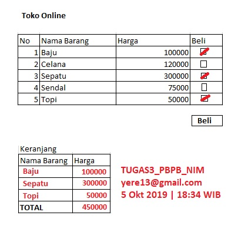

# PBP-Dosen-Tugas3

> Tugas Ini di rilis oleh  **Erlangga Ibrahim** secara terbuka (*Open Source*)
> Dibawah Lisensi **GNU GPLv3**. untuk keterangan dan informasi lebih lanjut mengenai
> Lisensi, dapat dibuka di : https://www.gnu.org/licenses/gpl-3.0.en.html
> atau dengan membaca file `LICENSE`
>  
> Semua sumber yang digunakan pada tugas ini, dapat dilihat pada :
> https://github.com/wowotek/PBP-Dosen-Tugas3
>  
> **PERINGATAN** : *Tugas ini dirilis **setelah tenggat waktu** pengumpulan tugas, dan tidak akan berlaku untuk kolega dengan tenggat waktu pengumpulan yang sama*
>  
> **PERINGATAN** : *Tugas ini dirilis **tanpa garansi**, termasuk nilai yang di-nihilkan oleh sebab **mencontek** dan/atau **menyalin** dan/atau **meniru** yang bersumber dari tugas ini*

## Pengawas / Dosen

* **Yerymia Alfa Susetyo** - *-*, *yere13@gmail.com*

## Penulis

* **Erlangga Ibrahim** (672017282) - *@wowotek*

## Deskripsi Tugas

### Ketentuan Pengerjaan
> NULL
### Lampiran Foto Penjelasan Tugas
